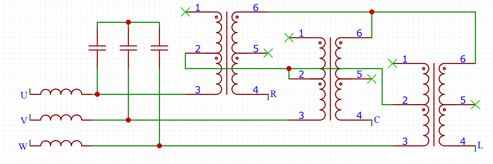

FOC-Stim is an implementation of the [Restim](https://github.com/diglet48/restim) threephase signal generation algorithm
for the [B-G431B-ESC1](https://www.st.com/en/evaluation-tools/b-g431b-esc1.html) electronic speed controller.

FOC stands for Field Oriented Control, an algorithm for controlling motors, referencing the intended purpose of the hardware.

It utilizes MRAC (model reference adaptive control) to generate consistent current-controlled waveforms
as environment conditions change.

Powered by SimpleFOC.

# Hardware setup

BOM:

* B-G431B-ESC1
* USB cable and 12v
* 3x transformer (XICON 42TU200-RC suggested)
* 3x inductor (100-470µH 1A, exact specs TBD)
* 3x ceramic caps (1-10µF 50v, exact specs TBD)

A panel-mount USB micro-B is useful if you want to make this into a nice box.
[USB Micro-B](https://www.sparkfun.com/products/15464)
or [USB B](https://www.sparkfun.com/products/15463).

How to wire:

`U`, `V`, `W` are the 3 outputs on the board, with `U` being the one closest to the potentiometer.

# Software setup

Install Visual Studio Code with plugins `platformio` and `teleplot`.  
Firmware should compile and upload without problems.

Inspect `FOC-Stim/src/config.h` to configure the current limits.

# Control

Control over serial with Restim.

View live stats with teleplot.

All restim features are supported except: pulse rise time, pulse interval random, vibration, transform.